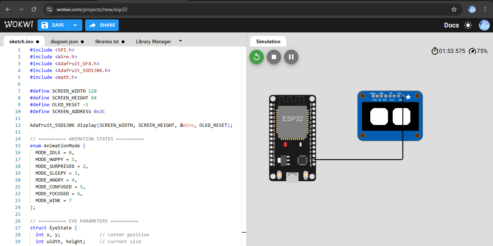

# Eye Animation System for ESP32

An expressive eye animation system for robots that can be integrated with LLM (Large Language Model) to make robots appear more alive and responsive.

## ✨ Key Features

### 🔄 Natural Idle Animations
- **Breathing Effect**: Eyes smoothly expand and contract like breathing
- **Alternating Pulse**: Left and right eyes alternately expand
- **Random Blink**: Random eye blinking at 2-5 second intervals
- **Pattern Switching**: Automatically switches idle patterns every 8 seconds

### 😊 Expressive Emotions
- **HAPPY** 😊: Wide eyes with smile effect
- **SURPRISED** 😲: Very large eyes
- **SLEEPY** 😴: Half-closed eyes
- **ANGRY** 😠: Squinting eyes with angry brows
- **CONFUSED** 🤔: Asymmetric eyes with question mark
- **FOCUSED** 🧐: Small concentrated eyes
- **WINK** 😉: Left eye closed

### 🔗 LLM Integration Ready
- Simple serial communication protocol
- Non-blocking animation system
- Real-time command responsive
- Easy integration with various AI frameworks

## 🛠️ Hardware Requirements

| Component | Specification |
|-----------|---------------|
| **Microcontroller** | ESP32 DevKit V1 |
| **Display** | OLED SSD1306 128x64 (4-pin I2C) |
| **Power** | 3.3V via ESP32 |
| **Connections** | I2C (SDA: GPIO21, SCL: GPIO22) |

## 📸 Documentation


*Figure 1: Eye animation system running in Wokwi simulator*

## 🔌 Wiring Diagram

```
ESP32          OLED SSD1306
─────────────────────────────
3V3      →     VCC
GND      →     GND
GPIO21   →     SDA
GPIO22   →     SCL
```

## 📦 Dependencies

```cpp
#include <SPI.h>
#include <Wire.h>
#include <Adafruit_GFX.h>
#include <Adafruit_SSD1306.h>
#include <math.h>
```

**Required Libraries:**
- Adafruit SSD1306
- Adafruit GFX Library

## 🚀 Quick Start

### 1. Hardware Setup
1. Connect OLED display to ESP32 according to wiring diagram
2. Upload the code to ESP32
3. Open Serial Monitor (115200 baud)

### 2. Testing
```
Serial Commands:
EXPR_HAPPY     - Happy expression
EXPR_SURPRISED - Surprised expression  
EXPR_SLEEPY    - Sleepy expression
EXPR_ANGRY     - Angry expression
EXPR_CONFUSED  - Confused expression
EXPR_FOCUSED   - Focused expression
EXPR_WINK      - Wink expression
EXPR_IDLE      - Return to idle
STATUS         - Check current mode
```

### 3. Wokwi Simulation
Use the `diagram.json` file for simulation on [Wokwi](https://wokwi.com):
1. Create new project
2. Copy and paste code and diagram.json
3. Run simulation

## 🤖 LLM Integration Examples

### Python Integration
```python
import serial
import time

# Connect to ESP32
ser = serial.Serial('/dev/ttyUSB0', 115200)

def set_expression(emotion):
    command = f"EXPR_{emotion.upper()}\n"
    ser.write(command.encode())

# Example LLM response handler
def handle_llm_response(text, sentiment):
    if sentiment > 0.7:
        set_expression("HAPPY")
    elif sentiment < -0.5:
        set_expression("ANGRY")
    elif "?" in text:
        set_expression("CONFUSED")
    else:
        set_expression("FOCUSED")
```

### Node.js Integration
```javascript
const SerialPort = require('serialport');
const port = new SerialPort('/dev/ttyUSB0', { baudRate: 115200 });

function setExpression(emotion) {
    port.write(`EXPR_${emotion.toUpperCase()}\n`);
}

// Example usage with OpenAI
async function handleChatResponse(message, response) {
    if (response.includes('!')) {
        setExpression('SURPRISED');
    } else if (response.includes('?')) {
        setExpression('CONFUSED');
    } else {
        setExpression('HAPPY');
    }
}
```

## 🏗️ Architecture

### Core Components
```
┌─────────────────┐    ┌──────────────────┐    ┌─────────────────┐
│   Serial Comm   │────│  Animation Engine │────│  Display Driver │
└─────────────────┘    └──────────────────┘    └─────────────────┘
         │                       │                        │
         │              ┌─────────────────┐              │
         └──────────────│  Eye State Mgmt │──────────────┘
                        └─────────────────┘
```

### Animation States
```cpp
enum AnimationMode {
  MODE_IDLE = 0,      // Natural idle animations
  MODE_HAPPY = 1,     // Happy expression
  MODE_SURPRISED = 2, // Surprised expression
  MODE_SLEEPY = 3,    // Sleepy expression
  MODE_ANGRY = 4,     // Angry expression
  MODE_CONFUSED = 5,  // Confused expression
  MODE_FOCUSED = 6,   // Focused expression
  MODE_WINK = 7       // Wink expression
};
```

## ⚙️ Configuration

### Timing Parameters
```cpp
const unsigned long BLINK_INTERVAL_MIN = 2000;  // Min blink interval
const unsigned long BLINK_INTERVAL_MAX = 5000;  // Max blink interval
const unsigned long BREATH_CYCLE = 3000;        // Breathing cycle
const unsigned long IDLE_CHANGE_INTERVAL = 8000; // Idle pattern change
```

### Eye Dimensions
```cpp
const int REF_EYE_HEIGHT = 40;        // Default eye height
const int REF_EYE_WIDTH = 40;         // Default eye width
const int REF_SPACE_BETWEEN = 10;     // Space between eyes
const int REF_CORNER_RADIUS = 10;     // Eye corner radius
```

## 🎨 Customization

### Adding New Expressions
1. Define new mode in `AnimationMode` enum
2. Create animation function:
```cpp
void animateNewExpression() {
    // Set target eye dimensions
    left_eye.target_width = REF_EYE_WIDTH + modifier;
    left_eye.target_height = REF_EYE_HEIGHT + modifier;
    // Add custom drawing code
}
```
3. Add case in `updateAnimation()` switch statement
4. Add serial command handler

### Modifying Idle Behavior
Edit functions in the "IDLE ANIMATIONS" section:
- `updateIdleBreathing()` - Breathing effect
- `updateAlternatingPulse()` - Alternating pulse
- `updateRandomBlink()` - Random blinking

## 🐛 Troubleshooting

### Common Issues

**Display not working:**
- Check I2C connections
- Verify display address (0x3C or 0x3D)
- Test with I2C scanner

**Animations too fast/slow:**
- Adjust `delay(20)` in main loop
- Modify timing constants in configuration

**Serial commands not working:**
- Check baud rate (115200)
- Ensure proper line endings
- Verify command format (uppercase)

### Debug Mode
Enable debugging by uncommenting:
```cpp
// #define DEBUG_MODE
```

## 📈 Performance

- **Frame Rate**: ~50 FPS (20ms loop)
- **Memory Usage**: ~15KB RAM
- **Flash Usage**: ~200KB
- **I2C Speed**: Standard (100kHz)

## 🤝 Contributing

1. Fork repository
2. Create feature branch
3. Make changes
4. Test on hardware
5. Submit pull request

## 📄 License

MIT License - feel free to use in your projects!

## 📞 Support

- Create issue for bugs
- Discussions for feature requests
- Wiki for additional documentation
